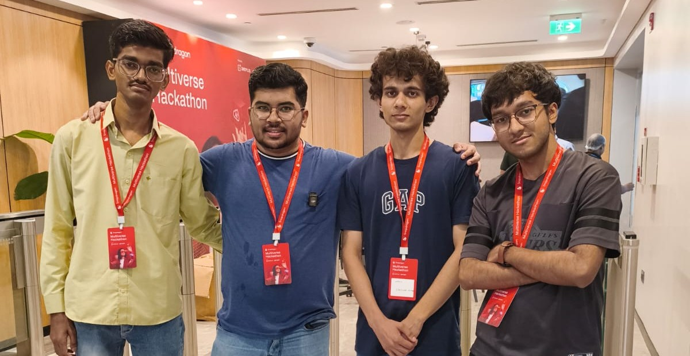
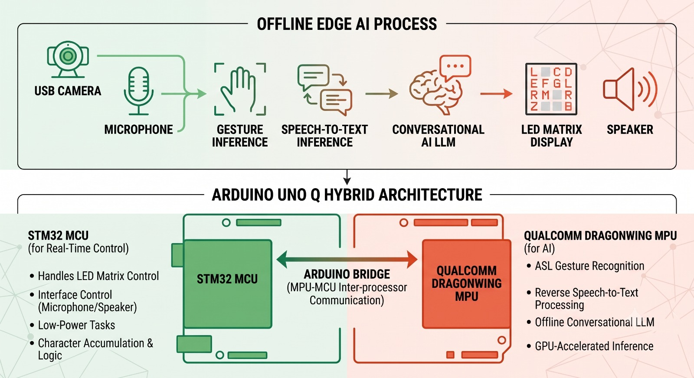

# 🌟 Team Profile & Project Vision: Sanchaar Mitra

We are **Team Sanchaar Mitra**, a highly specialized team of full-stack application architects, hardware systems developers, and electronics engineers. We have come together at the Snapdragon Multiverse Hackathon Noida to push the boundaries of distributed edge computing and assistive technology.

---

### 🌐 Our Vision

Our vision is to build an inclusive world where communication barriers do not dictate social mobility, economic capability, or human connection. According to the Census of India, over 5 million individuals live with hearing and speech disabilities, facing daily systemic hurdles in education, healthcare, employment, and public service access.

**Sanchaar Mitra** (meaning *Communication Friend*) is our direct response to this challenge. We believe that truly impactful assistive technology must be:
*   **Affordable & Accessible:** Independent of expensive subscription models.
*   **100% Cloud-Independent:** Capable of running seamlessly in rural or resource-constrained areas without requiring high-energy infrastructure or internet connectivity.
*   **Private & Immediate:** Operating with near-zero latency to mimic the natural rhythm of human conversation while keeping user data entirely secure at the edge.



---

### 🏆 Why We Deserve to Win the Snapdragon Multiverse Hackathon

Sanchaar Mitra is not just a concept; it is a fully functioning ecosystem that perfectly demonstrates the core philosophy of the Snapdragon Multiverse: **distributing intelligence to solve real-world problems at scale.** 

Here is why our solution stands out:

#### 1. True Distributed Multi-Device Orchestration
Instead of running a siloed application on a single device, we designed a genuine multi-device cooperative system. We strategically split the processing workloads based on hardware strengths:
*   **The Hub (Snapdragon® X Series Copilot+ PC):** Heavy vision algorithms (21-point hand landmark tracking) and local language modeling run on high-performance Qualcomm silicon for maximum throughput.
*   **The Edge Node (Arduino UNO Q):** Low-power UI rendering, microphone environment capture, and system mode state management are handled locally on the edge hardware.

#### 2. Advanced Architectural Integration
Our code fully exploits the bleeding-edge hardware provided at this hackathon. The system demonstrates seamless cross-device synchronization: the Snapdragon PC processes hand gestures, tokenizes the predicted text, and transmits it via serial to the Arduino UNO Q. The UNO Q then utilizes its unique hybrid architecture to route the data across the internal Bridge, instantly driving the physical $13 \times 8$ LED matrix via the STM32 MCU.

#### 3. Zero-Cloud Privacy & Low-Latency AI
We avoided the easy path of calling cloud APIs. By utilizing an optimized machine learning landmark model alongside a quantized, local instance of Llama 3.2 running via **Ollama**, the entire gesture-to-speech, speech-to-text, and conversational companion pipeline happens completely offline. 

#### 4. Sustainable & Production-Ready Engineering
By optimizing our local AI models and moving away from massive data centers, our system operates at a fraction of the carbon footprint of cloud-reliant solutions. Our codebase is production-ready, featuring multi-threaded background workers for Text-to-Speech (TTS) and LLM token processing to guarantee that the system never blocks or hangs during active human interactions.

---

We have taken next-generation multi-device hardware and engineered it into a life-changing utility. Sanchaar Mitra proves that when edge computing and purposeful design converge, we can build technology that leaves no one behind.

# 📁 Core System Engine Blueprint: ASL_UART_Gesture_Recognition

This section outlines the software layout, dependencies, environment provisioning, and runtime operational mechanics running locally on the **Snapdragon® X Series Copilot+ PC Hub**.

---

## 📂 File Architecture Breakdown

Based on the core engine directory, here is the functional utility of each asset:

*   **`asl_model.pkl`**: A serialized, pre-trained machine learning classification model containing optimized weights to resolve incoming 21-point hand landmark structural coordinates into text characters. *(Managed via Git LFS).*
*   **`uart.py`**: The baseline real-time Direct Communication routing script. It reads spatial landmarks via a fast serial stream, runs low-latency token verification, writes output back out to the matrix over serial, and directly pipes completed words into the local Windows background audio thread.
*   **`uart_llm.py`**: The AI Interaction Engine pipeline. It intercepts the manual sentence validation markers (`SEND`), accumulates the token string, posts the prompt buffer asynchronously to a local language model endpoint, and loops the structured output response directly back into the multi-threaded audio pipeline.
*   **`speak_heera.ps1` / `speak_heera1.ps1`**: Background Windows PowerShell script hooks utilizing the high-fidelity native `Heera` OneCore voice synthesis engine for clear speech playback.
*   **`test_serial.py`**: A diagnostic testing utility used to debug and validate read/write hand landmark transmissions across active COM device nodes.
*   **`comms.txt`**: System communication buffer logs used for logging transmission states.

---

It is coming out formatted inside a single `bash` code block because there is a **missing closing code block fence (`````)** right after the environment activation scripts!

Because the code block was never closed, the markdown renderer thinks everything after it—including your section headers, text descriptions, and bullet points—is just a long script inside that original `bash` window.

Here is the corrected portion with the code block closed properly so your headers and text render cleanly outside of the terminal box:

```markdown
### 1. Python Environment Initialization
Ensure Python 3.10+ is installed. Move into the workspace root directory and construct an isolated virtual environment:

```bash
# Generate the virtual environment directory (.venv)
python -m venv .venv

# Activate the virtual environment
# On Windows Command Prompt:
.venv\Scripts\activate.bat
# On Windows PowerShell:
.venv\Scripts\Activate.ps1

```

### 2. Core Library Installation

Install the explicit computational dependencies required by the system pipelines:

```bash
pip install numpy scikit-learn pyserial requests

```

#### 📦 Dependency Matrix Breakdown:

* **`numpy`**: Manages high-speed mathematical array shaping for incoming multi-dimensional landmark arrays.
* **`scikit-learn`**: Powers the underlying classification machine learning backend executing the workspace `.pkl` vector models.
* **`pyserial`**: Handles fast, non-blocking serial stream read/write input loops (`serial.Serial`) over low-level hardware communication limits.
* **`requests`**: Manages low-latency HTTP REST bindings to talk asynchronously with the local LLM generation loops.

```

```
```markdown
# 📁 Core System Engine Blueprint: ASL_UART_Gesture_Recognition

This section outlines the software layout, dependencies, environment provisioning, and runtime operational mechanics running locally on the **Snapdragon® X Series Copilot+ PC Hub**.

---

## 📂 File Architecture Breakdown

Based on the core engine directory, here is the functional utility of each asset:

*   **`asl_model.pkl`**: A serialized, pre-trained machine learning classification model containing optimized weights to resolve incoming 21-point hand landmark structural coordinates into text characters. *(Managed via Git LFS).*
*   **`uart.py`**: The baseline real-time Direct Communication routing script. It reads spatial landmarks via a fast serial stream, runs low-latency token verification, writes output back out to the matrix over serial, and directly pipes completed words into the local Windows background audio thread.
*   **`uart_llm.py`**: The AI Interaction Engine pipeline. It intercepts the manual sentence validation markers (`SEND`), accumulates the token string, posts the prompt buffer asynchronously to a local language model endpoint, and loops the structured output response directly back into the multi-threaded audio pipeline.
*   **`speak_heera.ps1` / `speak_heera1.ps1`**: Background Windows PowerShell script hooks utilizing the high-fidelity native `Heera` OneCore voice synthesis engine for clear speech playback.
*   **`test_serial.py`**: A diagnostic testing utility used to debug and validate read/write hand landmark transmissions across active COM device nodes.
*   **`comms.txt`**: System communication buffer logs used for logging transmission states.

---

## 🛠️ Environment Setup & Dependency Provisioning

To replicate this high-performance edge execution workspace on your Copilot+ PC, implement the following steps:

### 1. Python Environment Initialization
Ensure Python 3.10+ is installed. Move into the workspace root directory and construct an isolated virtual environment:
```bash
# Generate the virtual environment directory (.venv)
python -m venv .venv

# Activate the virtual environment
# On Windows Command Prompt:
.venv\Scripts\activate.bat
# On Windows PowerShell:
.venv\Scripts\Activate.ps1

```
## ⚙️ Detailed Deep-Dive: How It Works Under the Hood

The runtime system operates using an asynchronous, non-blocking multithreaded architecture designed to guarantee fluid human interaction without interface stuttering.

```text
       [ STM32 COM Stream ]
                 │
                 ▼  Raw "LM:" coordinate line
┌────────────────────────────────────────────────┐
│ 1. SERIAL LOOP & LANDMARK NORMALIZATION        │
│    - Strips data line down to 42 X/Y variables │
│    - Subtracts wrist origin offset values     │
│    - Scales array by middle-finger MCP span    │
└────────────────┬───────────────────────────────┘
                 │
                 ▼ Normalized Array Vector
┌────────────────────────────────────────────────┐
│ 2. PREDICTION CLASSIFICATION & CONFIDENCE CHECK│
│    - Passes vectors through `asl_model.pkl`    │
│    - Evaluates prediction confidence target    │
│    - Requires 2 matching frames to filter noise│
└────────────────┬───────────────────────────────┘
                 │
                 ▼ Verified Character Streams
       ┌─────────┴─────────┐
       ▼ (Direct Mode)     ▼ (AI Interact Mode: "SEND")
┌──────────────┐     ┌────────────────────────────────┐
│ Accumulates  │     │ 3. ASYNC LLM INTERACTION (Ollama)│
│ char stream  │     │    - Posts phrase to local LLM │
│ into word    │     │    - Streams token chunks back │
└──────┬───────┘     └───────────────┬────────────────┘
       │                             │
       └──────────────┬──────────────┘
                      │ Finalized Text Strings
                      ▼
┌────────────────────────────────────────────────┐
│ 4. BACKGROUND TTS WORKER THREAD ENGINE         │
│    - Intercepts word chunks dynamically        │
│    - Calculates variable execution timeout     │
│    - Bypasses terminal window UI to speak words│
└────────────────────────────────────────────────┘

```

### 1. Spatial Coordinate Ingestion & Normalization

The data loop intercepts raw lines parsing through the hardware boundary looking for an `LM:` payload. The text is isolated into a 63-element string array, where Z-axis coordinates are filtered out to keep 42 distinct 2D X/Y points.

To remain agnostic to hand distance or orientation shifts inside the camera viewing box, the array passes through a custom normalization algorithm:

* **Translation:** Every coordinate point subtracts the base wrist coordinate values ($X_0, Y_0$), locking the wrist vector directly to a centralized coordinate origin $(0, 0)$.
* **Scaling:** The coordinate layout calculates the absolute spatial Euclidean distance to the middle-finger MCP joint. The entire array vector is divided by this value, ensuring identical model detection accuracy whether a hand is close to the camera lens or far away.

### 2. Multi-Threaded Queue Isolation

To ensure the vision tracking loops run smoothly at maximum frame processing capabilities, all blocking programmatic actions are decoupled using dedicated background threads:

* **The TTS Audio Thread (`tts_worker`):** Monitored by a safe asynchronous `queue.Queue()`. When text objects arrive, it calculates a dynamically balanced safety execution timeout window based on character string length and triggers a hidden PowerShell subprocess executing your native `speak_heera.ps1` configurations without pausing the tracking scripts.
* **The LLM Processing Thread (`ollama_worker`):** Operates on an alternate loop. When a `SEND` ASL token is validated, the full text array pushes into the Ollama background queue, letting the primary loop return instantly to capture the next series of manual sign configurations.

### 3. Hysteresis Filtering & Frame Verification

To eliminate single-frame prediction noise, the architecture applies a dual-layered signal validation mechanism:

* **Confidence Ceiling:** The array is skipped if the vector confidence model doesn't hit a preset ceiling limit (`--min-confidence 0.20`).
* **Frame Stability Tracking:** The system relies on consecutive character tracking metrics (`CONFIRM_FRAMES = 2`). A token must be securely evaluated two times sequentially before the data loop confirms it, appends it to the active sentence array, and writes it back to the Arduino edge node matrix.
* 

```

```
```markdown

# 📁 Edge Subsystem Blueprint: Arduino_UNO_Q_Config


This section outlines the software configuration, dependency setup, and the underlying dual-brain operational mechanics executing locally on the **Arduino UNO Q Edge AI Node**.

---

## 📂 File Architecture Breakdown

Based on the edge application directory, here is the functional utility of each asset:

*   **`app.yaml`**: The structural deployment configuration manifest for Arduino App Lab, declaring application metadata, environment variables, and execution parameters.
*   **`python/`**: This directory runs on the high-performance Linux MPU (Qualcomm Dragonwing) layer.
    *   **`main.py`**: A multi-threaded Python application implementing an HTTP server (`ThreadingHTTPServer`) to render the system dashboard Web UI. It hooks into the user browser's Web Speech API for environment audio capture and exposes dual-mode toggles to coordinate data routing using the low-level `arduino.app_utils.Bridge` Remote Procedure Call (RPC) interface.
    *   **`logo.png`**: The local visual branding icon displayed on the active user dashboard interface.
*   **`sketch/`**: This directory deploys to the real-time microcontroller (STM32 MCU) layer.
    *   **`sketch.ino`**: The low-level firmware script responsible for matrix font array mapping, variable-speed layout tickers, non-blocking serial buffer sniffing, and RPC method registrations.

---

## 🛠️ Deployment Workflow & Dependency Provisioning

To deploy this distributed edge application to the hardware workspace, execute the following implementation steps:

### 1. Arduino App Lab App Ingestion
1. Connect to the local network or establish a direct access layout with the target hardware module.
2. Import the `Arduino_UNO_Q_Config` workspace directory into your active **Arduino App Lab** development environment.

### 2. Microcontroller (MCU) Library Provisioning
Before compiling the firmware stack, navigate to the library manager interface in your toolchain and ensure the following embedded libraries are added:
*   **`Arduino_LED_Matrix`**: Handles native hardware driver definitions for multiplexing the integrated $13 \times 8$ blue monochrome LED board array.
*   **`Arduino_RouterBridge`**: Implements the cross-architecture IPC hardware layer, establishing serial communication protocols to transfer variable states between the Linux MPU and the real-time STM32 MCU.

### 3. Execution & Port Forwarding Configuration
1. Compile and flash `sketch.ino` directly to the target board layer inside the workspace.
2. Start the internal application runner inside App Lab to spin up the Linux web micro-service on port `5002`.
3. To safely stream external environment audio data (Microphone inputs) through Chromium or related desktop browser engines, you must establish an encrypted secure shell tunnel to bypass browser localhost security constraints:

```bash
ssh -N -L 5002:127.0.0.1:5002 arduino@<UNO_Q_IP>

```

Once tunneled, navigate your browser interface locally to `http://127.0.0.1:5002` to interface with the active control room.

---

## ⚙️ Detailed Deep-Dive: Dual-Brain Processing Mechanics


The Arduino UNO Q works by leveraging an intelligent separation of powers between its co-processors, linked seamlessly via the internal **Arduino RouterBridge**.


```text
 ┌────────────────────────────────────────────────────────┐
 │ 1. DUAL-BRAIN INTERPROCESSOR IPC ROUTING (Bridge RPC)  │
 │    - Linux MPU exposes a dashboard UI on Port 5002.    │
 │    - Relays system mode tokens ("1" or "0") to MCU.    │
 │    - Exposes getters for text strings (`get_last_text`) │
 └───────────────────────────┬────────────────────────────┘
                             │ RouterBridge Link
                             ▼
 ┌────────────────────────────────────────────────────────┐
 │ 2. DYNAMIC REAL-TIME STATE MACHINE (sketch.ino)       │
 │                                                        │
 │  [Mode 0: Reverse Comm]         [Mode 1: Communication] │
 │  - Reads Speech-to-Text inputs  - Locks interface input │
 │    from dashboard UI over RPC   - Opens UART COM line   │
 │  - Renders spoken text chunks   - Sniffs parsed ML string│
 │  - Supports manual text box     - Triggers 2s inactivity │
 │    string inputs                - blanks matrix display │
 └───────────────────────────┬────────────────────────────┘
                             │ Font Mapping Output
                             ▼
 ┌────────────────────────────────────────────────────────┐
 │ 3. HARDWARE TICK MATRIX RENDERING                      │
 │    - Compares chars against 36 custom 7-byte glyph arrays│
 │    - Slides display offset window at clamped ticker ms │
 │    - Direct-drives built-in 13x8 matrix dynamically    │
 └────────────────────────────────────────────────────────┘

```

### 1. Dual-Brain Interprocessor Communication (IPC)

The MPU and MCU do not communicate via traditional file layers; they run an active RPC binding loop via `Arduino_RouterBridge`:

* **RPC Exposure:** The firmware registers explicit safe functions (`display_text`, `set_scroll`, `set_speed`, `set_mode`, `get_last_text`) using the macro `Bridge.provide_safe()`.
* **Polling Pipeline:** When operating in gesture tracking mode, the Python script on the MPU continuously calls `Bridge.call("get_last_text", "")` at a `300ms` window cadence. This lets the backend pull whatever string the physical serial lines have stamped into the MCU memory buffer and update the screen view arrays instantly.

### 2. Microcontroller State Machine & Hardware Sniffing

The `loop()` execution block inside the microcontroller operates two separate states controlled by `executionMode`:

* **Reverse Communication Mode (`executionMode == 0`):** The MCU waits passively for string vectors to drop in via the local web app dashboard commands (`/display` network hits). When a user speaks into their mic, the client parses the array, updates `message`, and triggers the matrix display array immediately.
* **Direct Communication Mode (`executionMode == 1`):** The web app inputs lock out. The loop continuously scans the physical serial buffer interface layer (`Serial.readStringUntil('\n')`). When string fragments stream over the serial cable link directly from the Snapdragon PC's machine learning vision engine, the internal timeout clock resets (`lastReceivedMs = millis()`) and the text is immediately displayed. If the frame array data stays blank for longer than `2000ms`, the screen is instantly cleared to prevent old layout text from freezing on the matrix.

### 3. Bit-Shifted Matrix Rendering & Variable Ticker Ticks

Text symbols are rendered pixel-by-pixel using a compact custom font array layout mapping out letters `A-Z` and numbers `0-9`.

* **Font Matrix Structure:** Each character is defined as a $5 \times 7$ bit-grid mapped across 7 specific bytes (e.g., `0b01110` for an outline slice row).
* **Bit-Sniffing Classifiers:** The function `columnForText()` scans the current scroll coordinate position offset ($X$), isolates the exact character pixel index, evaluates the vertical column state, and applies a bitwise mask shift (`(font[idx][row - 1] >> (GLYPH_WIDTH - 1 - localCol)) & 1`) to determine whether an LED should fire or remain dead.
* **Clamped Scroll Engine:** Ticker motion updates are tracked using non-blocking delta clock limits (`millis() - lastStepMs < scrollDelayMs`). Speed parameters are kept safe within a clamped interval boundary ($90\text{ ms} \le \text{delay} \le 320\text{ ms}$) to ensure clear legibility on the $13 \times 8$ grid.

```

```
